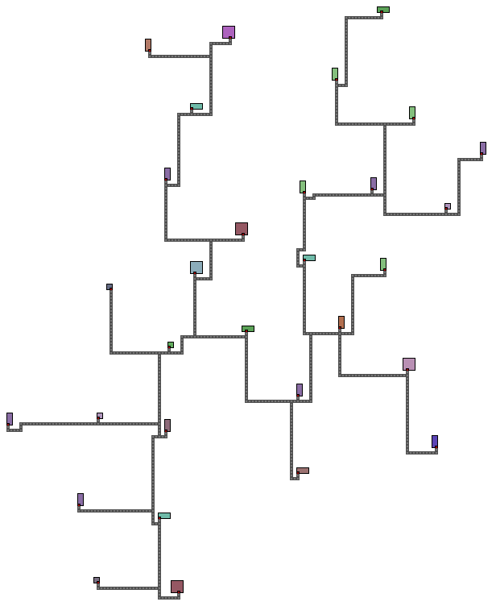
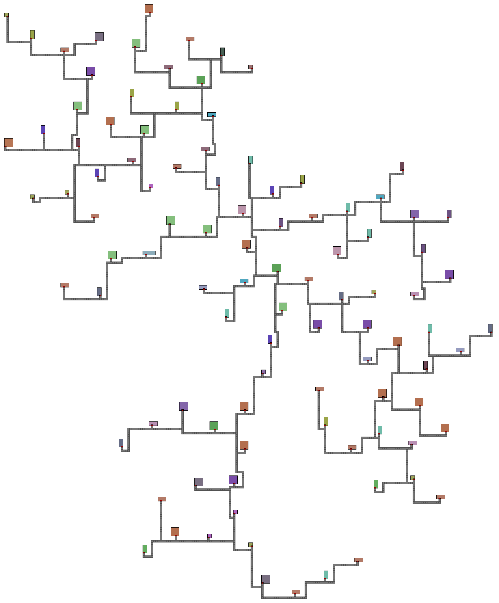
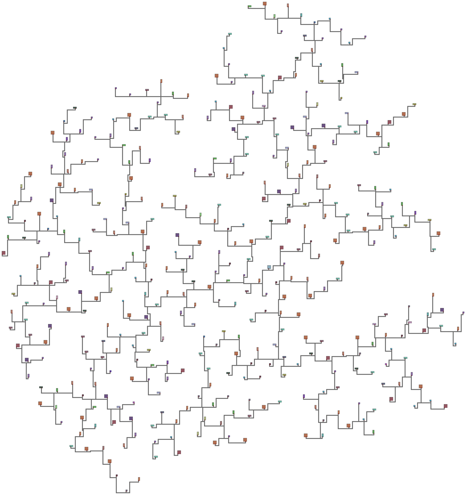

# 📦 Алгоритм процедурной генерации деревни

## 🧭 Назначение

Алгоритм автоматически размещает дома и прокладывает дороги между ними в целочисленной координатной сетке.

## ⚙️ Возможности

### Генерация домов:

* Настройка **минимального расстояния между любыми двумя домами**
* Управление **диапазоном расстояний от нового дома до "родительского"**
* Задание **максимального радиуса деревни**

### Генерация дорог:

* Установка **минимального расстояния от дороги до любого дома**
* Настройка типа дорог: **прямоугольные или диагональные**

### Ограничения:

* Дверь дома всегда располагается на **южной стороне**
* Генерация более **400 домов может занять длительное время** (от 10 секунд)
* **Нет поддержки замкнутых дорог** (дороги не образуют кольца)

---

## 🏠 Формат описания "шаблона" дома
#### Все дома в деревне основаны на шаблонах, в шаблонах описываются размеры дома, частота появления в деревне и положение относительно центра
### 1. Случайный дом

Используется при вероятностной генерации.

**Формат:**

```python
[[x_size, y_size], door_block, house_id, probability]
# Тип: [[int, int], int, int, float]
```

**Пример:**

```python
[[3, 4], 2, 6534, 0.2]
```

* Размер: 3×4
* Дверь: на 2-м блоке снизу (отсчёт слева направо)
* ID: 6534
* Вероятность появления: 20%

> 🔸 Сумма вероятностей всех случайных домов не должна превышать 1. Если меньше — возможны "пустоты" (пропуски домов).

---

### 2. Специальный (гарантированный) дом

Добавляется строго указанное количество раз и в заданной удалённости от центра.

**Формат:**

```python
[[x_size, y_size], door_block, house_id, position, count]
# Тип: [[int, int], int, int, float, int]
```

**Пример:**

```python
[[4, 2], 1, 811, 0.9, 3]
```

* Размер: 4×2
* Дверь: на 1-м блоке (слева)
* ID: 811
* Позиция: 0.9 (далеко от центра, ближе к краю)
* Количество: 3 дома

> `position` — число от 0 до 1, где 0 — центр деревни, 1 — её край

---

### 📌 Описание параметров

* **door\_block** — номер блока (1 … x\_size), на котором размещена дверь (всегда снизу)
* **house\_id** — уникальный идентификатор дома

---

## 🏗️ Главная функция: `generate_village()`

### 📥 Параметры:

| Название             | Тип                     | Описание                                                   |
| -------------------- | ----------------------- | ---------------------------------------------------------- |
| `house_templates`    | `list`                  | Список "шаблонов" всех домов (случайных и специальных)                |
| `count_house`        | `int`                   | Общее количество домов в деревне                           |
| `min_dist`           | `int`                   | Минимальное расстояние между любыми двумя домами           |
| `attach_dist_minmax` | `list[int, int]`        | Диапазон расстояния от нового дома до родителя             |
| `min_distance`       | `int`                   | Минимальное расстояние от дороги до дома                   |
| `delta_grid_size`    | `int`                   | Дополнительный запас клеток под дороги (рекомендуется ≥10) |
| `shift_diagonally`   | `bool`                  | Разрешены ли диагональные дороги                           |
| `max_village_radius` | `int or None`           | Максимальный радиус деревни (None — без ограничений)       |
| `seed`               | `int/float/str or None` | Сид деревни (None — случайный)                             |

---

### 📤 Возвращает:

1. **Список домов**
   Каждый дом — кортеж:

   ```python
   (x, y, x_size, y_size, door_block, house_id)
   ```
   > *x, y - кординаты вершины дома с наименьшими значениями*

   **Пример:**

   ```python
   [(0, 0, 3, 4, 2, 6534), (-4, 10, 4, 2, 1, 811)]
   ```

2. **Список дорог**
   Каждая дорога — список координат клеток:

   ```python
   [[(0, 0), (0, 1), (0, 2)], [(-3, -4), (-3, -3), (-3, -2)]]
   ```

---

## 🔧 Пример использования

```python
from generate_village import generate_village
from generate_houses import random_generate_houses_list
from vizualization_png import generate_village_image

# Генерация списка из 20 случайных домов
house_list = random_generate_houses_list(20, [2, 6], [1, 5])

# Генерация деревни с 50 домами
houses, roads = generate_village(
    house_list,
    count_house=50,
    min_dist=7,
    attach_dist_minmax=[7, 10],
    min_distance=3,
    delta_grid_size=15,
    shift_diagonally=False,
    max_village_radius=100,
    seed=None
)

# Визуализация (1 клетка = 10 пикселей)
generate_village_image(houses, roads, cell_size=10)
```

---

## 🧩 Генерация по частям

### Класс `Generator_houses(...)`

Генерация только домов, без дорог.

**Пример:**

```python
from generate_houses import Generator_houses

generator = Generator_houses(min_dist, attach_dist_min, attach_dist_max, max_village_radius, seed)
houses = generator.generate_houses(house_templates, count_house)
```

**Параметры:**

1. При создании экземпляра класса:
   * `min_dist` — минимальное расстояние между домами
   * `attach_dist_min` / `attach_dist_max` — диапазон расстояний до родителя
   * `max_village_radius` — максимальный радиус деревни
   * `seed` — 
2. При генерации:
   * `house_templates` — список шаблонов домов
   * `count_house` — целевое количество домов

**Возвращает:**
Список домов в формате, аналогичном `generate_village()`

---

### Функция `generate_roads(...)`

Генерация только дорог по готовому списку домов.

**Пример:**

```python
from generate_roads import generate_roads

roads = generate_roads(houses,min_distance,delta_grid_size,shift_diagonally)
```

**Параметры:**

* `houses` — список домов `(x, y, dx, dy, door_block, id)`
* `min_distance` — минимальное расстояние дороги от дома
* `delta_grid_size` — запас сетки (дополнительно растояние по бокам деревни для генерации дорог)
* `shift_diagonally` — диагональные дороги

**Возвращает:**
Список координат клеток дорог

---

**Примеры Деревень**




